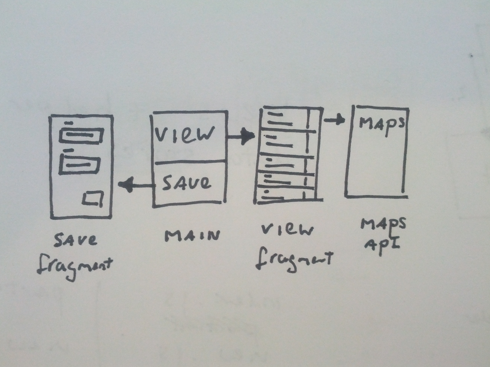

## Proposal
1. Features
2. Wireflow
3. Components

## Features
- A user can save a location with a name.
- A user can view all saved locations.
- A user can open a saved location in maps.
- A user can delete a saved location.

## Wireflow

## Components
- views
  - A 'main' view with a 'view' and 'save' button
  - A 'save' fragment with a 'name' field.
  - A 'view' fragment with a list of 'location' adapters.
  - A 'location' adapter which 

- models
  - A 'location' model with the following properties
    - Altitude (float)
    - Latitude (float)
    - Name (string)
    - Date created (num / dateTime)

- controllers
  - A main controller
    - Load 'main' view
    - Start gps
    - Start DB
  
  - Save controller
    - Load 'save' view
    - Handle input
      - if field wasn't filled in: throw
      - write submission to db
      - clear submission
      - nav back to main
  
  - View controller
    - Load 'view' view
    - Render a location adapter for each location in DB
    - on adapter click load x, y -> maps intent
    - on adapter delete, remove adapter from db